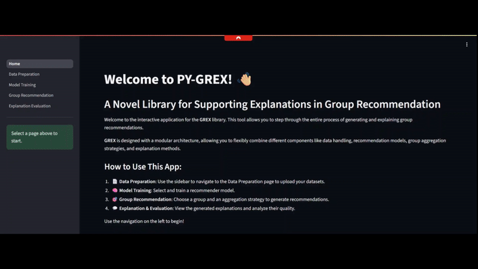

<p align="center">
  <a href="https://github.com/toledomateus/py-grex" rel="noopener">
  </a>
</p>

<h3 align="center">PY-GREX: An Explainable Group Recommender Systems Toolkit</h3>

<div align="center">

[](https://github.com/toledomateus/py-grex) 
[](/LICENSE)
[](https://github.com/toledomateus/py-grex/issues) 
[](https://github.com/toledomateus/py-grex/pulls)
[](https://badge.fury.io/py/pygrex)

</div>

---

<p align="center"> A software toolkit for explainable group recommender systems, including several state-of-the-art explainability methods and evaluation metrics.
    <br> 
</p>

## ✨ Live Demo

Experience PY-GREX without any installation through our interactive web application, built with Streamlit.

**➡️ [Platform live demo](https://pygrex.streamlit.app/)**



---

## 🧐 About

Recommender systems heavily shape our digital experiences. Consequently, there's a growing demand for insight into how these systems generate predictions, not just for individuals but also for groups of users.

Recognizing that explanations enhance trust, efficiency, and even persuasive power, researchers have actively pursued this area. Yet, the field lacks a standard, accessible toolkit for implementing and evaluating these techniques, especially for the nuanced domain of group settings.

PY-GREX addresses this critical need, offering a modular Python toolkit equipped with multiple state-of-the-art explainability algorithms to facilitate research and development in eXplainable AI (XAI) for Recommender Systems.

---

## 🚀 Features

PY-GREX provides a modular, end-to-end pipeline for explainable group recommendations.

- **Recommendation Models**:
  - **Matrix Factorization**:
    - Alternating Least Squares (ALS)
    - Singular Value Decomposition (SVD)
    - Bayesian Personalized Ranking (BPR)
    - Explainable Matrix Factorization (EMF)
  - **Neural Networks**:
    - Generalized Matrix Factorization (GMF)
    - Multi-Layer Perceptron (MLP)
    - Neural Collaborative Filtering (NCF)
    - Deep Autoencoder
  - **Memory-Based**:
    - User-Based K-Nearest Neighbors
    - Item-Based K-Nearest Neighbors
  - **Other Models**:
    - Item2Vec
    - MF-Implicit

- **Group Aggregation Strategies**:
  - **Consensus-Based**:
    - Additive Utilitarian
    - Multiplicative Utilitarian
    - Average Satisfaction
  - **Majority-Based**:
    - Borda Count
    - Plurality Voting
  - **Fairness-Oriented**:
    - Least Misery
    - Most Pleasure
    - Most Respected Person

- **Explanation Methods**:
  - **Counterfactual**: 
    - Sliding Window Explainer (Counterfactual Explanations)
  - **Rule-Based**: 
    - EXPGRS (Association Rules Explainer)
  - **Local Explainers**: 
    - LORE4Groups (Local Rule-Based Explanations)

- **Evaluation Metrics**:
  - **Accuracy**: 
    - Hit Ratio (HR)
    - Normalized Discounted Cumulative Gain (nDCG)
  - **Explainability**: 
    - Model Fidelity
    - Gaussian Intra-List Diversity (GILD)
    - Rule Support and Confidence
---

## 🏁 Getting Started

### Installation

You can install PY-GREX directly using pip:

```bash
pip install pygrex
```

This will install all the required dependencies automatically. PY-GREX requires Python 3.11 or higher.

### Local Development

If you want to run the project locally for development:

1. **Prerequisites**: 
   - Python 3.11 or higher
   - Git
   - Conda (recommended)

2. **Clone the repository**:
   ```bash
   git clone https://github.com/toledomateus/pygrex.git
   cd pygrex
   ```

3. **Create and activate a Conda environment**:
   ```bash
   conda create -n pygrex python=3.11
   conda activate pygrex
   ```

4. **Install in development mode**:
   ```bash
   pip install -e .
   ```

This will install the package in development mode, allowing you to modify the source code and see the changes immediately without reinstalling.

---

## 🎈 Usage

### Running Locally

To run the Streamlit app locally:

1. **Install Streamlit**:
   ```bash
   pip install streamlit
   ```

2. **Run the app**:
   ```bash
   streamlit run Home.py
   ```

The app will be available at `http://localhost:8501`

### Interactive Web App
The easiest way to use PY-GREX is through the web application. It allows you to:
-   **Upload or use default data** for users, items, and groups
-   **Select and train** a variety of recommendation models
-   **Generate group recommendations** using different aggregation strategies
-   **Produce and evaluate explanations** for the recommendations

### Jupyter Notebooks
For detailed examples, check out the notebooks in the `notebooks/` directory:
- `expgrs_toy_example.ipynb`: Demonstrates the EXPGRS rule-based explainer with association rules
- `sliding_window_toy_example.ipynb`: Shows how to use counterfactual explanations with the Sliding Window method
- `lore4groups_toy_example.ipynb`: Illustrates local rule-based explanations using LORE4Groups

Each notebook provides comprehensive examples with real datasets and detailed explanations of the methods.

---

## 🤝 Contributing

Contributions are what make the open-source community such an amazing place to learn, inspire, and create. Any contributions you make are **greatly appreciated**.

If you have a suggestion that would make this better, please fork the repo and create a pull request. You can also simply open an issue with the tag "enhancement".

1.  Fork the Project
2.  Create your Feature Branch (`git checkout -b feature/AmazingFeature`)
3.  Commit your Changes (`git commit -m 'Add some AmazingFeature'`)
4.  Push to the Branch (`git push origin feature/AmazingFeature`)
5.  Open a Pull Request

---

## 📚 Citation

If you use PY-GREX in your research, please cite our paper:

```bibtex
@article{pygrex2025,
  title={PY-GREX: A Python Toolkit for Explainable Group Recommender Systems},
  author={[Authors]},
  journal={[Journal]},
  year={2025}
}
```
---

## 📜 License

This project is licensed under the MIT License. See the `LICENSE` file for details.